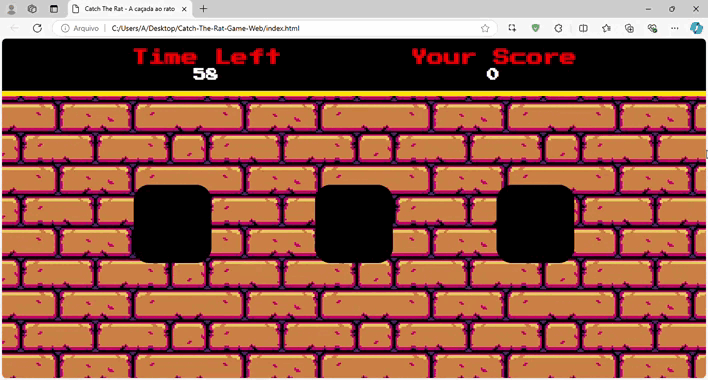

# Catch The Rat: A Caçada ao Rato

*Catch The Rat* é um **game web** simples e divertido onde o objetivo é capturar o rato que aparece aleatoriamente em tocas. Desenvolvido em HTML, CSS e JavaScript, este jogo pode ser jogado diretamente no navegador. Todas as artes do jogo foram criadas em **pixel art** por mim, dando ao jogo um estilo único e personalizado. Com um fundo estilizado em tijolos e uma animação do rato, o game oferece uma experiência leve e descontraída para quem quer testar sua agilidade online.

